# Measurement and Data Collection

This section enumerates the procedure for measuring AIT. Researchers 
should follow these procedures every day and for every experiment performed to 
ensure consistent results. The first priority should always be safety. 
Therefore, if any step of this process is found to be unsafe or pose an 
unacceptable risk it should be changed. This method is designed to conform to
the ASTM E659 Method. Therefore, any policies and procedures violate standards
set forth in ASTM E659 should be rectified to maintain conformity.

## Startup

1. Ensure the lid is off the pressure vessel and the vessel is being 
    vented by the snorkel
    - Under normal operation, the vessel should be vented with the snorkel any time the vessel is open
    - The only exception to this rule is when the experimental setup has
    been shut down for an extended period of time for maintenance 
    purposes

2. Check the lab book to see if the flask needs to be changed before turning on the furnace. If needed, change the flask (See Section refsec:flask_lid) and **indicate you did so in the lab notebook**.

3. Ensure the furnace is plugged in to the 220 V outlet on the edge of the hood
   
4. Power on the furnace and set furnace temperature between 10 - 20 degrees above your initial target flask temperature 

   - When powered on initially, the furnace may take 2 hours or more to reach a desired temperature and thermally equilibrate
   - Use the TADA_UI to track the internal temperature of the flask
   - Once the internal temperature starts to reach equilibrium, you may adjust the set point temperature until the target temperature is reached
   - **CAUTION: The furnace may be hot during the start up sequence. Avoid touching anything inside the area enclosed by the aluminum ring atop the furnace including the ring itself.**

5. Ensure the vessel rupture disk is intact and positioned correctly (See Figure 1)

   1. See the training on proper rupture disk installation if the this is not the case

   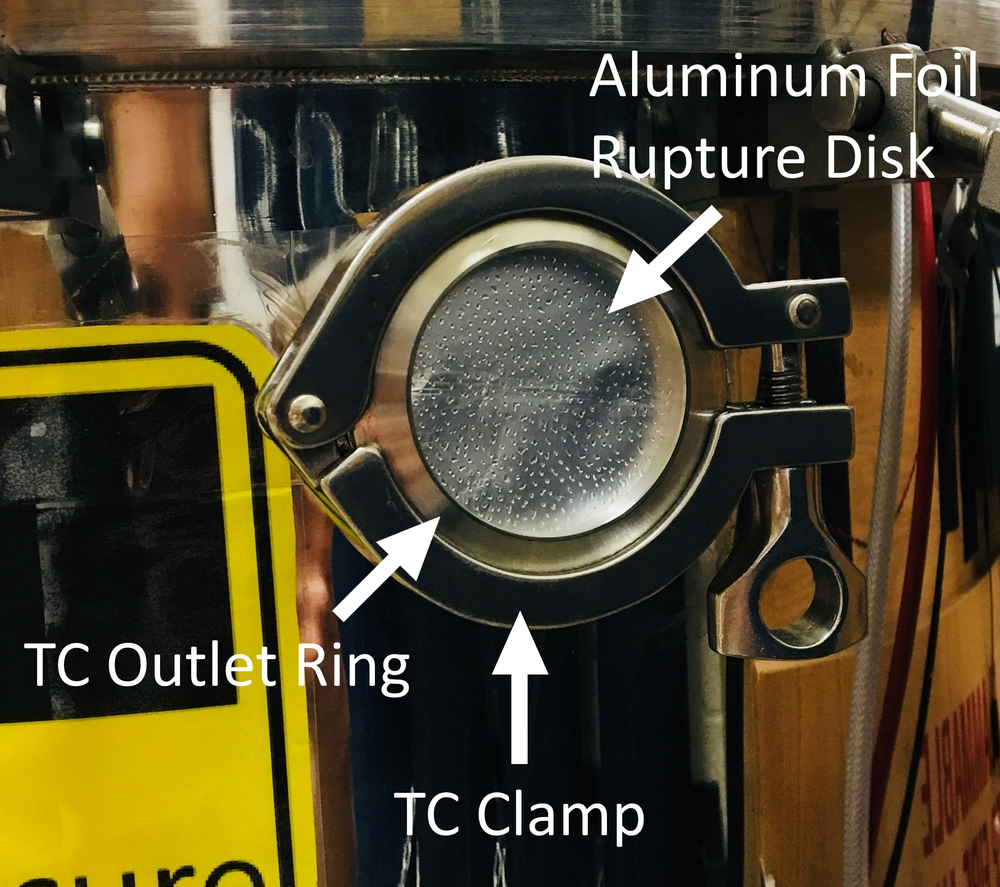

6. Start up computer and log on

   - Use the "AIT Research Assistant" account to log in
     - Username: aitra
     - Password: hotflame16

7. Ensure a compatible SD card is inserted securely into the TADA datalogger (see Figure reffig:sd_card_reader)
    

9. Ensure the 4 furnace thermocouples are connected to their 
   corresponding connectors inside the vessel and ensure that the wires are
   tucked down between the side of the furnace and the wall of the vessel 
   and are out of the way (see Figure reffig:Thermocouples)

   - Thermocouple wires coming out of the furnace are numbered and
     should connect to the corresponding brown wire connected to 
     the TADA
    

10. Connect the TADA to the lab computer via the USB cable mounted 
    under the edge of the hood (see Figure reffig:tada_connect) 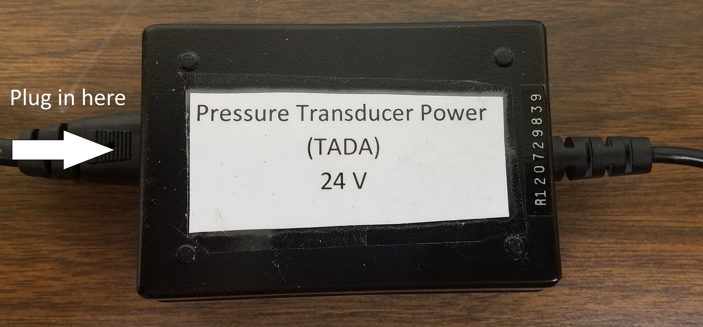

11. Plug in the wall power to the TADA 241.volt power supply (see Figure 
    reffig:tada_connect)

12. Open the TADA user interface program

    - There should be a shortcut to this program on the desktop
- Path: `/home/aitra/Documents/ait_exp/tada/tada_main.py`
    - The program will open two windows. **Ensure both windows are visible while using the program.**
    - The serial communication LED in the TADA will start flashing
    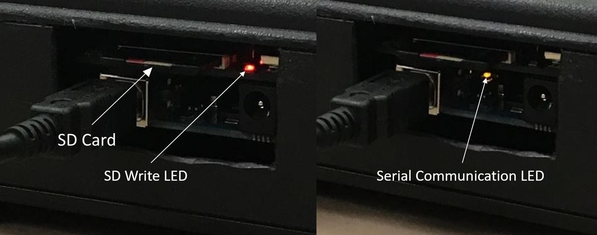<!-- fig:tada_leds -->
    
12. Twist both of the ARIA lead screws by hand such that the mounting plate is all the way down and touching the base plate and the push block all the way back and is touching the horizontal stepper motor. (This is the shutdown position. See Figure reffig:shutdown_position)
      <!-- fig:shutdown_position -->
    
13. Ensure the three molex cables are securely plugged in to the ARIA (see Figure reffig:Molex_cables)
    - Regardless of the experiments to be performed, ensure all three are plugged in and the corresponding cables are not strained
     <!-- fig:Molex_cables -->

14. Plug 5 volt power supply into the ARIA control and wait for initial setup sequence to complete (The two button lights on the ARIA control will come on when the sequence is complete) (See Figure reffig:5V_cable)

    <!-- fig:5V_cable -->

15. Test the placement of the ARIA using the funnel and ring stand

    - Use nitrile gloves when touching the ARIA

    - Ensure the ring stand is secure in the ARIA, place the funnel in the ring stand and run the solid program (Press the  "Solid" Button **without gloves on**)

    - Note that the end of the ring stand rod must be nearly flush with the inside surface
       of the ring stand mount block (See Figure reffig:flush_r_stand)

    - If the funnel does not go directly into the flask, adjust the placement and retest 
      until properly positioned

       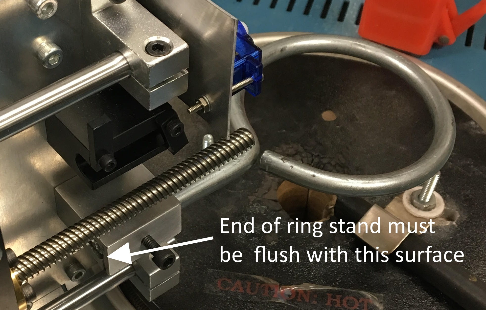<!--fig:flush_r_stand -->

16. Test the placement of the mirror using the tablet and camera % SEE FIGURES

   - Connect the computer to the camera's Wi-Fi (See Section refsec:cam_tab on how to do this)
   - Open the Camera Suite app to use the camera's view finder
   - Mount the camera on the side of the furnace (See Section refsec:cam_on_furn)
   - Using the camera's view finder, adjust the position of the mirror on the furnace to align the camera's view to see directly down the center of the flask
   - The camera should be positioned so that the hole in the furnace and the mirror are visible 
   - Once you have aligned the mirror, remove and shutdown the camera for initial furnace heating

17. Check the glass wool air filter in the inlet of the rotameter replace if necessary (See Section ???<!--Add section thingy here-->)

18. Once the target temperature is reached, allow the system to come to equilibrium

    - The "Temp Ready" indicator in the TADA_UI window should turn green when the system has come to an acceptable equilibrated state
    - Sometimes the "Temp Ready" indicator may not turn green if the flask was not installed correctly (See Section refsec:flask_lid) or there are problems with the thermocouples even when the flask has reached thermal equilibrium. Therefore, while heating up or changing temperatures, check the temperatures that are displayed in the command line window of the TADA_UI. If the temperatures are not within about 20 K of each other the thermocouples may not be placed properly. If this is the case experiments may proceed as normal but thermal equilibrium must be verified manually by using the data on the command line window and neglecting the misplaced thermocouple.
    - If any of the thermocouples in the command line window of the TADA_UI read "NAN" (not a number) then that thermocouple is not connected. Check all thermocouple connections and reconnect the thermocouple if possible.

## Experimental
This section outlines the steps for experimental runs. Each experiment should be performed following these steps exactly (insofar as that is possible). Doing so will ensure consistent results with the lowest uncertainty possible.

### Pre-Experimental Safety Checks

Before beginning experiments, ALL operators must do the following:

- Ensure your workspace, the area around the computer and both hoods are free of clutter, tripping hazards or anything which could present a hazard to you or anyone else in the lab
- Review Safety Data Sheets (SDS) and understand all hazards presented by all compounds that will be handled
  - This needs to be done only once before handling each compound for the first time but, SDS's should be reviewed periodically
  - All chemical handling should be done in the hood whenever possible. The main exceptions to this rule are for injection into the furnace and using the mass balance.
  - Refer to the compound's SDS for specific recommendations on chemical handling 
- Ensure you are using appropriate PPE for handling chemicals (e.g. nitrile gloves and splash goggles)
  - Refer to the SDS for the chemical you are working with when determining appropriate PPE
  - NOTE: Some SDS's will recommend using a face shield in addition to splash goggles when handing their respective  chemicals. In our lab we will use ventilation hoods which, when used properly, serve as better protection than face shields. Therefore, any time an SDS recommends using a face shield you may safely ignore that recommendation provided you are using the hood properly by positioning the sash between your face and the work being performed in the hood.
  - Unless an SDS states otherwise, lab coats are recommended but not required when handling chemicals

### Experimental Procedure Steps

1. Measure out sample

    - Liquids
      - Before measuring a sample out for the first time, clean the syringe of any residual compound
        1. Take 2 clean 100 ml beakers and put them in the hood (these will be your sample
           and waste beakers)
        2. Place a small amount of compound into the sample beaker
        3. Rinse the syringe of any extraneous compounds 3 times by drawing approximately 300 microliters into the syringe from the sample beaker and eject it into the waste beaker
      - Draw sample amount into a right-angle syringe
        1. Begin by drawing an excess amount of compound into the syringe
        2. Draw slowly to minimize air bubbles in the syringe
        3. Hold syringe vertically to move air bubbles to the top, gently tapping the 
           syringe if necessary
        4. Carefully eject the syringe into the waste beaker to remove any air bubbles until
           the syringe reads the desired amount
      - The final sample size should not exceed 250 microliters
    - Solids

      - Measure out sample on a weigh boat
        1. Open the scale door by pressing the button with an asterisk '*' and place a new and empty weigh boat on the center of the scale plate
        2. Close the scale door with the asterisk button, and tare the scale
        3. Remove the weigh boat before measuring out sample
        4. Using a clean chemical spatula, scoop the desired amount from the compound container to the weigh boat, replacing the weigh boat on the scale to check until the desired mass is reached
        5. Take note of the initial mass of the compound sample (the mass should exceed the desired mass by about 10 mg)
        6. With the sample and weigh boat on the scale, tare the scale
        7. Remove the weigh boat from the scale for AIT measurement
      - The initial sample size should not exceed 300 mg
    - Gases

      - Draw sample amount into a right-angle syringe  
      - Sample size should not exceed 250 microliters
1. Secure the sample to the ARIA
1. Liquid/Gases Sample

1. Place the syringe securely into the syringe holder on the 
ARIA, making sure the needle is in the funnel
			1. Test placement one more time to ensure the funnel is guided 
into the injection hole (for a liquid sample use the 
solid button)

1. Solid Sample

1. Carefully insert the weigh boat into the weigh boat holder and
press the weigh boat holder onto the servo shaft so the weigh 
boat is in a near1.horizontal position
			1. Test placement one more time to ensure the funnel is guided 
into the injection hole (for a solid sample use the 
liquid button)

1. Remove gloves before proceeding
	1. Ensure the camera has sufficient battery and is powered on

1. Reconnect the camera to the tablet if necessary

newpage
1. Secure the camera to the side of the furnace

1. textbfNote for unpressurized experiments: If you are performing
unpressurized experiments (i.e. experiments with the lid off) you
may safely skip the next textbfthree steps. Ensure before 
proceeding that the vessel is being vented by the snorkel.

1. textbfSimultaneously remove the snorkel from inside the vessel and 
place above the rupture 
disk (see Figure reffig:rupture_hood) textbfand place lid on 
pressure vessel and secure in place with the clamps and cable

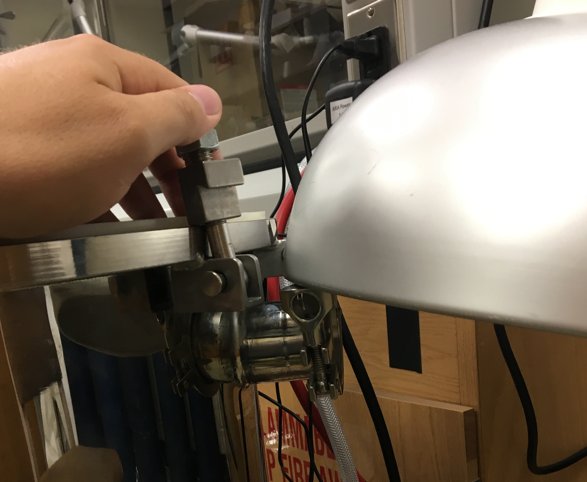
Snorkel placement during operation
<!--fig:rupture_hood

1. Two people are required to perform this step. One to remove the 
snorkel (Person B) and the other to place the lid (Person A)            
1. Person A: open the sash on the hood vertically and carefully  
pull out the vessel lid ensuring the outlet hose does not catch  
on anything (do not pull it through the sliding doors)

1. Use caution when handling the lid; the lid is heavy

1. Person B: Lift up the bell on the snorkel so it can swing away
from the open pressure vessel
1. Person A and B: Simultaneously, place the lid on the vessel and
swing the snorkel away from the vessel. This should be done in one
simultaneous motion.
1. Person B: Place the snorkel over the rupture disk as seen in 
Figure reffig:rupture_hood.
1. The rest of the procedure requires only 1 person
1. When placing the lid, hold the lid directly above the vessel and 
carefully lower it straight down on the vessel to avoid hitting the
ARIA with the lid. Make sure to avoid crimping the outlet hose and 
keep it as smooth and straight as possible
1. Line up the two marks on the lid with the corresponding marks 
on the vessel
1. Ensure the lid is centered on the vessel by running your fingers
around the edge to ensure the edge of the vessel and the lid are
flush 
1. Check that the lid lies flat on the O1.ring and no wires or debris 
will break the seal
1. Hand tighten all the pressure vessel clamps on the lip of the lid 
so the slack is taken out
1. Using your other hand to keep the pressure vessel from rotating, 
			tighten the clamps in opposing pairs following the numbering on 
the back of each clamp (See Figure reffig:sec_lid) using a 
torque wrench, tightening each clamp until the torque reads 
60 inch pounds
1. Tighten each clamp again with the torque wrench, this time by 
going around the circle, ensuring that torque is 60 inch pounds on 
each.
1. Loop the safety cable through both lid handles and through the 
handles on both sides of the vessel and then back through the lid 
handles so the two ends meet then secure the two ends together 
(See Figure reffig:sec_lid)

subfloat[Clamp numbering](../media/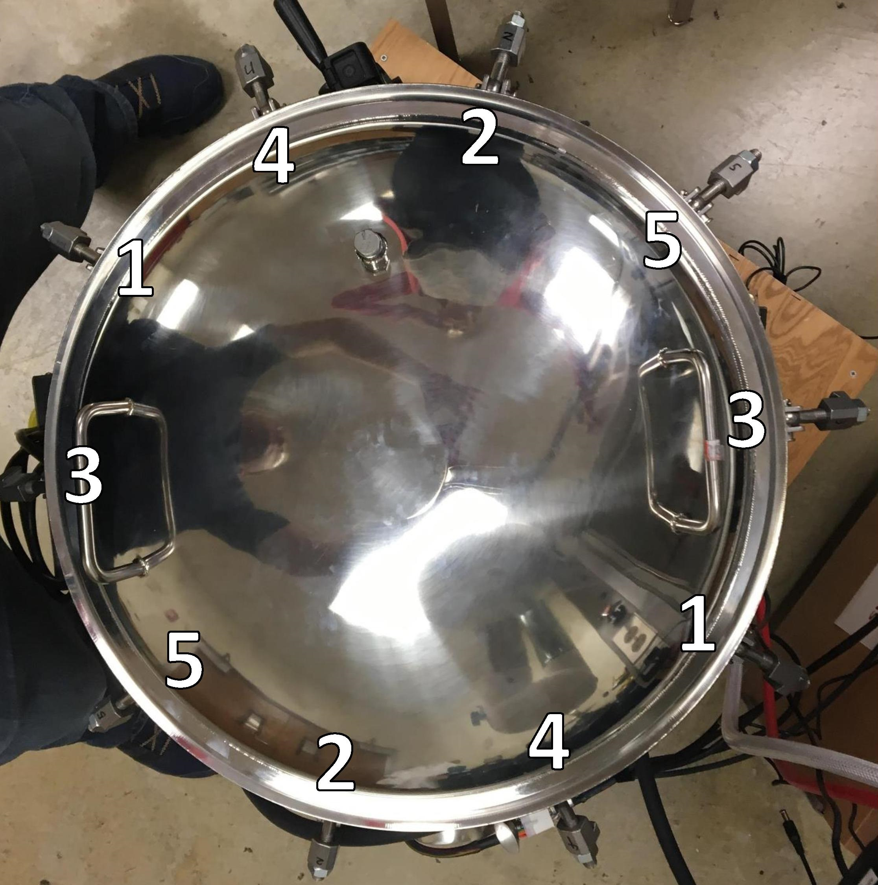 
subfloat[Safety Cable Installation](../media/ 
1. Fully open the rotometer on the exhaust of the pressure vessel by 
textbfgently rotating the rotometer knob counterclockwise 
1. If it has not been done earlier in the day, slowly open the 
			cylinder valve all the way and then turn back one quarter turn
1. Once the regulators are pressurized, slowly open the ball valve
1. Slowly close the rotometer (rotate clockwise) until the air flow 
reads 25 SCFH (The flow rate is read at the middle of the floating ball)
1. Allow 1 1. 2 minutes for equilibrium to be reached initially
1. Adjust pressure in vessel using low pressure regulator until the    
absolute pressure reading in the TADA_UI is highlighted green 
indicating that the pressure in the vessel is sufficiently close 
to 1 atm (760 torr)

1. This is easier with two people. One to read the pressure off 
the TADA_UI and the other adjust the regulator
1. While pressurizing, make sure that the rotometer reads about 
25 SCFH. This may take some adjusting back and forth.
1. Ensure that there are no leaks around the lid before proceeding
			1. Allow at least 20 secs for equilibration each time the pressure 
				is changed
1. textbfLeak protocol: If a loud, high pitched noise is heard 
or the pressure read on the TADA_UI fails to rise, there is a 
leak. If this occurs, do the following:

1. Identify where the leak is happening (using the sound or
    snoop A.K.A. Soapy water)
1. If the leak is happening anywhere besides the O1.ring,
    immediately close the ball valve and allow the vessel to 
    fully vent to ambient pressure to fix the leak
1. If the leak is happening somewhere along the O1.ring,
    verify that there is no debris or wires breaking the seal.
    If a seal break from debris or wires is found, immediately 
    close the ball valve and allow the vessel to 
    fully vent to ambient pressure to fix the leak
1. If there is no debris or wires breaking the seal, use the
    wrench to slowly tighten the clamp nuts around the leak 
    until it stops
1. If this does not work or you suspect a different problem,
    immediately close the ball valve and allow the vessel to 
    fully vent to ambient pressure to fix the leak

1. Ensure the vessel is sufficiently dark to see any 
flame from the mirror on top of the furnace

1. In the TADA_UI program, press the "Choose Target File" button and 
choose where to save your file

1. Save all temperature data files in comma separated values (.csv) 
format
1. Path: textitC:textbackslash Userstextbackslash 
Publictextbackslash Documentstextbackslash AITtextbackslash 
datatextbackslash compound_nametextbackslash filename.csv
1. File naming convention: 

1. Filenames will be organized by the following values in order 
separated by underscores ("_")
   
    1. Compound name
    1. Date of experiment with the format "YYMMDD"
    1. Time of day that data collection began for that run
        using a 24 hour clock format "hhmm"
    1. Sample size in microliters (for liquids) or milligrams
        (for solids and gases)
    1. Test temperature in degrees Celsius (rounded to the 
        nearest integer)
        
  
1. For example: The file name of an AIT experiment where 100 
microliters of hexane were tested at 450 degree C on 
March 19, 2013 at 4:25 pm would be: newline
"hexane_130319_1625_100_450.csv"
   
1. This action will reset the TADA for measurement

1. Write down everything you know in the TADA_UI and the lab book 
(i.e. date, time, sample size, temperatures etc.).

1. Begin data collection 

1. textbfNote for unpressurized experiments: If you are performing
unpressurized experiments (i.e. experiments with the lid off)
turn off the lights and ensure the laboratory is sufficiently dark 
to see any flame from the mirror on top of the furnace 
textbfbefore beginning data collection.
1. In the TADA_UI program, press the Enter key or click the 
"Collect Data" button on the TADA_UI
1. The TADA_UI will keep track of the elapsed time since data 
    collection began at the bottom of the window. This may be used
    to time the experiment

1. Press the red button on the tablet screen to start recording

1. Press the green or blue button on the ARIA control box that 
corresponds to the physical state of the sample
(green for solid, blue for liquid) to initiate ARIA sample injection.

1. textbfNOTICE: If you need to abort the injection before
it completes, immediately unplug the AIRA power.
1. If you mistakenly press the wrong button, do NOT abort the 
injection. A button mis1.press is inconsequential. Simply allow the 
injection to complete then press the correct button.

1. Watch for an ignition event for 10 minutes

1. Upon injection, a small temperature drop is always observed. This
is the start of the 10 minutes
1. A temperature rise above the initial temperature indicates an 
exothermic reaction has occurred
1. An ignition event is defined by the presence of a visible flame
(visible to either the camera or the operator)
1. An ignition event is characterized by a large, sharp temperature 
rise exceeding $15 fracKs$. This is referred to as
a temperature spike
1. The experiment ends when one of the following criteria is met:

1. An ignition event is observed and the temperature returns to 
a steady state
1. 10 minutes pass with no ignition event observed

1. Stop and power off the camera with the Capture app about 10 
seconds after a temperature spike occurs or after a visible flame 
disappears
1. If temperature spike is observed, allow enough time for the
temperature to return to a steady state before terminating 
temperature data collection
		1. If no ignition event is observed nor expected, after a 
temperature rise reaches a maximum the camera may be stopped 
before 10 minutes have elapsed
1. The TADA_UI may be used to keep track of time

1. If necessary, review the camera footage, looking for a flame 
corresponding to the temperature spike

1. This may be done on the Capture app on the tablet

1. Record pertinent data and observations in the lab book and 
the TADA_UI textbfBEFORE terminating temperature data collection

1. The date of the experiment must be recorded once in the notebook
1. The following data must be present on the same row in the lab 
notebook, in the following order:

1. Time of day that data collection began
1. Compound name 
1. Sample size in microliters (for liquids) or milligrams
(for solids and gases)
1. Set1.point temperature of the furnace
1. Test temperature in degrees Celsius (NOT rounded)

1. This should be the internal flask temperature 
    (Thermocouple 4) prior to injection

1. Indicate the type event that took place ("h" for hot1.flame 
ignition, "c" for cool1.flame ignition and "n" for no ignition)

1. If the flame is bright yellow/orange, this is considered a 
    hot1.flame autoignition
1. If the flame is faint and blueish, this is considered a 
    cool1.flame autoignition

1. Indicate if any sound was heard upon ignition (if applicable)

1. If any item is not applicable write down N/A in its place
1. If any item is unknown, leave it blank until it can be determined
1. Optionally, leave any pertinent comments about the experiment
next to or directly under this row of data
1. Record the same data in the corresponding fields in the TADA UI
textbfbefore terminating temperature data collection
1. The lot number and/or sample number of the container with the 
supplier and any other pertinent information related to the source
of the compound should be recorded at least once in the lab 
notebook. Ensure that these data are present

1. After the experiment ends, terminate data collection

1. Press the Enter key  again to stop data 
collection (the red light on the TADA should stop blinking)
1. If you haven't already, press the red button on the tablet screen 
to stop recording
1. Shut down the camera from the tablet

1. Set furnace to next temperature

1. textbfNote for unpressurized experiments: If you are performing
unpressurized experiments (i.e. experiments with the lid off) you
may safely skip the next textbffour steps. Ensure before 
proceeding that the vessel is being vented by the snorkel.

1. Wait about 20 minutes after ignition to allow for the pressure 
vessel to be purged of the combustion products. If there was no ignition,
		only wait 10 minutes for the pressure vessel to purge after the experiment ends 
1. After the purge time has ended, depressurize the vessel

1. Turn off the inlet air flow using the ball valve
1. Fully open the rotometer by gently turning the knob counterclockwise
		1. Wait until the pressure vessel is textbffully depressurized 
(i.e. the rotometer reads zero)

1. Remove the pressure vessel lid by textbffirst loosening and 
disengaging the clamps and textbfsecondly removing the safety cable

1. Loosen the clamps using a 3/4" wrench instead of a 
torque wrench
		1. Break the seal on the lid by briefly lifting the lid with the safety cable still in 
place
1. Remove the safety cable from the vessel

1. textbfSimultaneously Lift off the lid and place snorkel inside the pressure vessel 
between 6" and 10" over the furnace (this may be done with 1 person)

1. Lift the hood sash to allow the lid to be placed back inside
1. Pull the bell of the snorkel up to allow the snorkel to swing 
1. Swing the snorkel to a position above the vessel
1. Pull the bell back down to the end of the snorkel and let it fall
on top of the lid
1. Ensure the snorkel is loose enough to fall down into the vessel
upon removing the lid
1. Remove the lid by pulling directly upward before moving laterally
and allow the snorkel to fall down into the venting
position inside the vessel
1. Place the lid carefully back in the hood and close the sash, 
running the lid outlet hose through the small opening in the corner
of the sash
1. Ensure the snorkel is placed properly and is venting the vessel

	1. Remove the camera from the vessel and connect it to the computer to
begin video extraction
1. Remove any syringe or weigh boats used in the previous experiment

1. textbfUse gloves when doing this
1. Dispose of any weigh boats in the solid waste

1. Clean out the flask between measurements by blowing hot air into
the flask for 5 minutes using the heat gun on the low setting

1. The heat gun should textbfonly be plugged in to the outlet 
when in use
1. Do not point the heat gun towards the ARIA at any time

1. Extract, save and appropriately rename the video data between 
experiments (See Section refsec:vid_ex). Remember to delete the video
off the camera once you have made sure that it is saved to the computer.
1. Once the next temperature is reached, allow the system to come to 
equilibrium

1. The "Temp Ready" indicator in the TADA_UI window should turn 
green when the system has come to an acceptable equilibrated state
1. Once the system is at equilibrium, begin experiments

1. Once the system is at equilibrium, start this procedure over from 
step 1 (Measure Out Sample)
endenumerate

## Shutdown

1. The following should be done before leaving the lab at the end of 
every work day or any time the setup is not in use:
beginenumerate
1. Power off the furnace
1. Close the TADA_UI program
1. Unplug TADA USB connection
1. Unplug the wall power from the TADA power supply
1. Unplug the ARIA power supply cable
1. Shut down and unplug the tablet
1. Turn the camera Wi1.Fi off then shut down and unplug the camera
1. Extract all data to the computer and appropriately rename them 
(Refer to Section refsec:data)
1. Close all programs and shut down the computer

1. Remove and store any ARIA accessories used that day (leave the 
ring stand in place)
1. Clean the funnel with appropriate solvents and dispose of the waste
1. Discard the contents of both beakers and prepare them for dish washing
1. Discard any residual sample in syringes and store them in the syringe box in the AIT
drawer without rinsing %% Change POLICY for syringes
1. Store all chemicals in the appropriate cabinets
1. Remove any organic solid residue from working surfaces 
(See Section refsec:spill_solid)
		
		1. Ensure all air systems are depressurized 
			
			1. Ensure the ball valve is closed (the handle should be perpendicular to the flow)
			1. Slowly close the cylinder valve all the way
			1. Open the ball valve by turning the handle parallel to the flow
1. Wait until both regulators depressurize
			

endenumerate

1. A hot furnace may be left with the pressure vessel open and the snorkel 
venting it without waiting for it to cool
1. Under normal use, disposable gloves may be thrown into the normal 
trash receptacle instead of solid chemical waste

newpage    

# Data Extraction <!--sec:data
During experiments data are being recorded on the lab computer, the data logger 
and the camera. Both the camera and the data logger on the TADA have SD cards 
with a 32 GB storage capacity that allows multiple runs to be recorded without 
extraction. The following policies are in place to ensure ease of use, 
efficiency and avoid common mistakes.

## General Policies

1. All data, including video and raw temperature data should be 
extracted at least textitdaily
1. Video data should be extracted and properly renamed as often as  
possible (i.e. between every run or every other run) to ensure the 
correct filenames are assigned to their corresponding video files
1. The datalogger data is there as a redundant backup to the UI data in 
case of data loss. Therefore it will be mainly archived and used only
when the original data cannot be found
1. After processing, all data should be organized according to the 
following conventions:

1. Path: textitC:textbackslash Userstextbackslash 
Publictextbackslash Documentstextbackslash AITtextbackslash 
datatextbackslash compound_nametextbackslash filename.ext
1. All data from the same run should have the same
filename but different extensions
1. The corresponding data from the datalogger will be archived and
accessed as needed
1. When processing is finished all runs should have the following 
3 files with the same name preceding them

1. A .png/jpg) file (for temperature data with graphs and analysis)
1. A .csv file (TADA_UI generated)
1. A .avi/.mp4 file stored on the DIPPR Legacy Server
(this video file will have a different path and extension but 
the same filename)

1. File naming convention:

1. Filenames will be organized by the following values in order 
separated by underscores ("_")

1. Compound name
1. Date of experiment with the format "YYMMDD"
1. Time of day that data collection began for that run
    using a 24 hour clock format "hhmm"
1. Sample size in microliters (for liquids) or milligrams
    (for solids and gases)
1. Test temperature in degrees Celsius (rounded to the 
    nearest integer)

1. For example: The filename for temperatures from an AIT experiment  
where 100 microliters of hexane were tested at 450
degree C on March 19, 2013 at 4:25 pm would be: newline 
"hexane_130319_1625_100_450.csv" newline
1. The corresponding video file would be named:newline
"hexane_130319_1625_100_450.MP4" 

## Video Extraction <!--sec:vid_ex
Extract video data by plugging in the camera via USB and using 
GoProtextsuperscripttextcopyright Quik software

1. Connect the camera to the computer via a micro USB cable (See 
Figure reffig:cam_diag)
1. Press the "info/wireless" button on the camera to connect the 
camera to the computer
1. Quik should be configured to open automatically extract video 
when the camera connects to the computer. If Quik is not configured 
to do this, refer to the Quik manual for how to configure this 
(or ask me and I will configure it)

1. textitC:textbackslash Userstextbackslash 
Publictextbackslash Documentstextbackslash AITtextbackslash 
docstextbackslash GoPro_App_for_Desktop_User_Manual.pdf
1. Quik login:

1. username/email: dipprlab.ait@gmail.com
1. password: hotflame16

1. Video files should automatically be extracted to the DIPPR  
Legacy Server (a.k.a. The Properties of Gases and Liquids  
6textsuperscriptth Edition Server) and organized by date

1. Path: textittextbackslash textbackslash 
   pgl6ed.byu.edutextbackslash aitratextbackslash 
   video
1. Username: dipprlegtextbackslash aitra
1. Password: hotflame16

1. Do NOT configure video files to be automatically deleted after 
import
1. Once you have ensured all video data have been have been properly
saved in the appropriate data folder, delete all files from the 
camera using the Quik "delete all" button

## Datalogger Extraction
To extract data from the datalogger:

1. Unplug the TADA from the computer
1. Pull out the SD card from the data logger and use the USB SD card 
adapter to copy the "DATALOG.CSV" file into the "raw_data" path and 
rename it to the original filename with the date 
tagged on in "YYMMMDD" format (e.g. "DATALOG_130319.CSV")

1. Path: textitC:textbackslash Userstextbackslash 
Publictextbackslash Documentstextbackslash AITtextbackslash 
datatextbackslash raw_data

1. Once you have ensured the data log file has been copied and 
renamed successfully, delete the "DATALOG.CSV" file on the SD card
(the SD card should be empty)
1. Close all windows with the USB SD card adapter open 
(i.e. Windows Explorer etc.)
1. Pull out the SD card without ejecting the unit from the computer

newpage
# Spill Clean1.up <!--sec:spills
In the event of any spill, appropriate PPE specified in the corresponding SDS 
should be used in clean1.up. Always check the SDS for special considerations
when cleaning up any compound.
## Liquids

1. In the event of a small spill (i.e. less than 100 ml), the following 
protocol should be followed:

1. If the spill occurs in or out of the hood, use absorbent clay that
can be found under the counter west of the sink to soak up the 
bulk of the liquid and wipe up the rest with a paper towel
1. Dispose of the clay, any disposable gloves and towels in the solid 
waste container
   
1. In the event of a large spill (i.e. greater than 100 ml), the 
following protocol should be followed:

1. If the spill occurs in the hood, use absorbent clay that can be 
found under the counter on the left1.hand side of the lab sink to 
soak up the bulk of the liquid and wipe up the rest with a paper 
towel
1. Dispose of the clay, any disposable gloves and towels in the solid 
waste container
1. If the spill occurs outside the hood or the spill is particularly 
large (e.g. an entire bottle of a flammable material breaks) 
textbfperform the Emergency Shutdown Procedure (Section 
refsec:e_shtdn), evacuate the lab and call: BYU Risk Management 
and Safety 1. (801)1.4221.4468 

1. Spills involving compounds that are particularly toxic or unstable 
should always be considered large spills

## Solids <!--sec:spill_solid
We will generally work with organic solids that readily dissolve in simple
organic solvents (e.g. acetone). Researchers must always check chemical 
compatibility with solutes and solvents before dissolving any compound.

1. Small amounts of organic solids may be dissolved in a small amount of 
solvent and put in organic liquid waste
1. Larger amounts of solids should be transferred to solid waste and the
residue should be dissolved in solvent and discarded in liquid waste

newpage    
# Emergency Shutdown <!--sec:e_shtdn

1. In the event of an emergency do the following:

1. Close the air cylinder valve
1. Power off and unplug the furnace
1. Fully open the rotometer exhaust
1. Unplug all other electrical equipment
1. Stop the camera recording (if applicable)
1. Shutdown and unplug the camera and tablet
1. Close all programs and shutdown the computer

1. If an emergency requires you to evacuate the lab, do only the first 
2 steps
1. textbfDO NOT perform any steps that present a danger to you

newpage
blankpage
# Experimental Setup and Maintenance
## Furnace
### Overview

1. The furnace, shown in Figure reffig:furnace_pic, is an encased 
stack of ceramic insulation with cavities 
cut out to allow space for the heating elements and the test flask
(see Figure reffig:in_furnace for an internal diagram of the 
furnace). The furnace is controlled with measurements taken at the 
insulated furnace wall. This design causes the furnace to have
large temperature gradients while in operation. As a result, the 
set point temperature and the flask temperature will almost always 
differ significantly (as much as 25 K in some cases). Therefore, 
set points must be chosen between approximately 10 1. 20 K above the 
desired temperature to reach that temperature inside the flask.
textbfThe reported AIT must be taken from the internal flask 
temperature (Thermocouple 4) and NOT the control thermocouple inside
the furnace

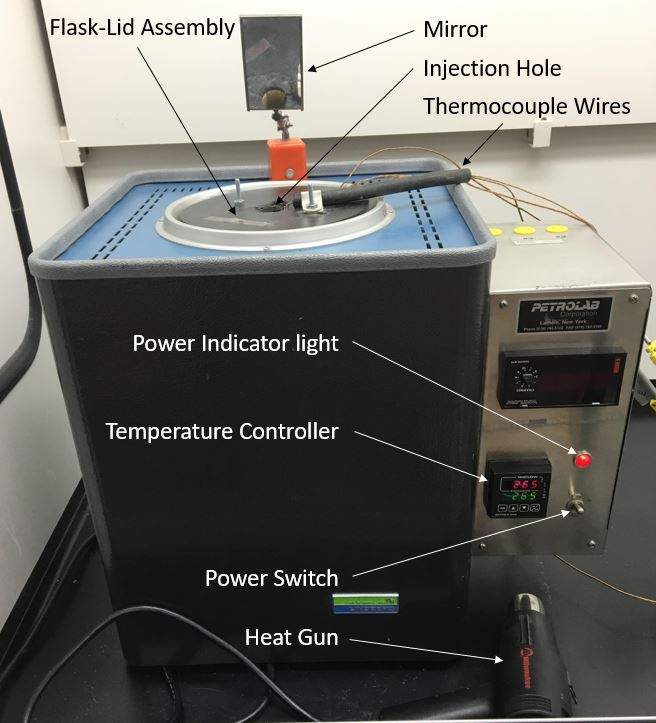
AIT Furnace
<!--fig:furnace_pic

1. When powered on initially, the furnace may take up to 2 hours or more  
to reach a desired temperature and thermally equilibrate
1. Any time a desired temperature is reached, allow at least 30 
minutes for thorough thermal equilibration in the flask; allow extra 
time during initial start up

 

### Furnace Operation
See Figure reffig:furnace_pic for reference on how to operate the furnace

  1. Power on the furnace with the power switch and use the temperature
controller to choose a set point temperature

1. To change the set point, press the up or down     arrows until 
the desired temperature is reached
1. The lower (green) display is the set point and     the upper 
(red) display is the control thermocouple temperature

1. When shutting down, turn off the power switch and unplug the furnace

## Camera and Tablet <!--sec:cam_tab
### Overview

1. Prior to using the experimental setup, all researchers must become 
familiar with basic use and operation of the 
GoProtextsuperscripttextcopyright HERO4
SessiontextsuperscriptTM camera and the Samsung Galaxy Tab A Tablet. 

More detailed instructions on how to do basic tasks may be found at the 
following URLs:

1. texttthttps://shop.gopro.com/softwareandapp
1. texttthttps://gopro.com/help/articles/Block/How1.to1.Pair1.the1.Camera1.with1.the1.GoPro1.App#HERO4 Session
1. texttthttps://gopro.com/help/articles/Block/Getting1.Started1.with1.the1.GoPro1.App
1. texttthttp://www.samsung.com/us/support/owners/product/galaxy1.tab1.a1.81.01.wi1.fi

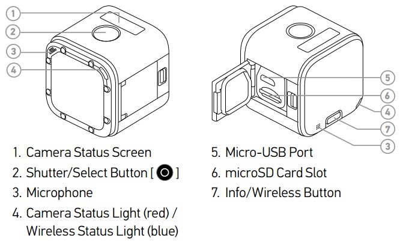
GoProtextsuperscripttextcopyright HERO4
SessiontextsuperscriptTM Camera Parts
<!--fig:cam_diag

Samsung Galaxy Tab A
<!--fig:tablet

1. Refer to Figures reffig:cam_diag and reffig:tablet for camera 
and tablet setup

 

### Connecting to the camera 

1. Firmly press and release the ``info/wireless" button on the back of
the camera (not the red circle) multiple times until you see 
``APP & RC" on the camera status screen
1. Press the ``shutter/select" button (the button with the red 
circle) to confirm your selection

1. The ``wireless status" (blue) light will begin flashing. This 
indicates the camera is broadcasting a Wi1.Fi signal 

1. Power on the tablet by holding down the power key (top, right side) until you see the
splash screen indicating the tablet is booting up
1. When first powering on both devices ensure they both are 
sufficiently charged. If not, immediately plug them in
1. Once the tablet has booted, swipe to get to the home screen and 
select the ``Settings" app
1. Select the Wi1.Fi settings at the top of the list on the left side 
of the screen
1. Select the Wi1.Fi network <!--ed ``ait_cam_2016" then select 
``connect" on the message box that pops up (FYI: the wifi password is
``hotflame16")
1. Once the tablet has connected to the Wi1.Fi, return to the home 
screen by pressing the home key
1. Open the GoPro Capture App (app is <!--ed ``Capture" on the home 
screen) 
1. Select the connect box on the top left corner of the screen to connect to camera
1. Press the camera icon in the center of the screen

1. The camera will make a beeping noise and the camera view will 
open on the tablet

### Shutdown

1. To shutdown the camera:

1. Press the ``info/wireless" button 
until the camera status screen reads ``Turn Wi1.Fi Off"
1. Press the ``shutter/select" button to confirm your selection

1. The ``wireless status" (blue) light will stop flashing

1. Press the ``info/wireless" button until the camera status 
screen reads ``Exit"
1. Press the ``shutter/select" button to confirm your selection

1. The camera will shutdown 

1. To shutdown the tablet:

1. Press the ``Recent" button to bring up all opened programs and 
close all programs by swiping on them or pressing the 'X' in the
top right corner
1. Press and hold the Power key until the option to power of 
pops up then press power off

1. The tablet will shutdown

### Camera Placement and Removal  <!--sec:cam_on_furn

1. To mount the camera on the furnace:

1. Lift the rubber flap on the base of the camera buckle 
out of the way to allow the buckle to slide into the camera 
mount 
1. Insert the plastic buckle into the camera mount on the side 
of the furnace until it snaps securely into place
1. Press the rubber flap back into place to lock the camera 
buckle into the camera mount 

1. To remove the camera from the furnace:

1. Lift the rubber flap on the base of the camera buckle 
out of the way to allow the buckle to slide out of the camera 
mount
1. Squeeze the two catches on the camera buckle and pull the 
buckle out of the camera mount

### Other Information

1. Camera Operation

1. All operations may be done remotely on the tablet via Wi1.Fi or 
directly with the ``info/wireless" and ``shutter/select" buttons on 
the camera. For experimental purposes, only basic operations
will be covered. For more detail on camera 
operation please see the URLs above
1. In the camera's off or normal modes the ``shutter/select" button 
toggles recording or standby; the camera will automatically shut off
after a few seconds on standby
1. If the camera is remotely controlled, the on screen red button 
toggles recording or standby
1. During recording, the camera will not allow viewing via the 
tablet. This is due to the high frame rate of our experiments
1. Captured video may be reviewed and managed remotely with the grid
button on the bottom left corner of the screen
1. The camera may be powered on and off remotely with the power  
button on the top right corner of the screen. The camera should be 
powered off between experiments or when not in use

1. Batteries:

1. Recharging power supplies and USB cables are available for both
the tablet and camera
1. Both the camera and the tablet may be charged while in use
1. Do NOT charge tablet with the computer as it does not deliver 
enough current for effective charging
1. Batteries should be allowed to discharge to between 10 1. 20%
before recharging
1. Batteries should always be recharged to 100% capacity before 
unplugging
1. Do not overcharge any battery. Do not leave any battery 
charging overnight

## Pressure Vessel
### Changing the rupture disk
We use 1100 alloy extra thin aluminum foil as a rupture disk. This material has 
been shown to be effective in preventing catastrophic failure in the vessel. 
This section outlines how to change and test the rupture disk. (See Figures 
reffig:rupture disk_assemble and reffig:rupture_disk for reference)

subfloat[O1.ring on Foil](../media/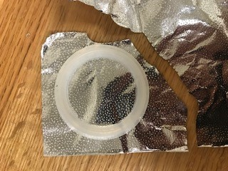 
%qquad
subfloat[Sandwich the foil between O1.ring and TC outlet 
ring](../media/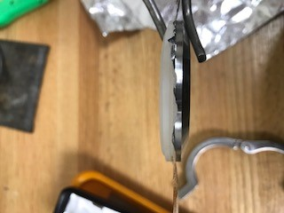 
subfloat[Fold the foil back](../media/ 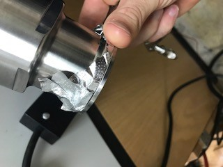 
Installing a new rupture disk
<!--fig:rupture disk_assemble

beginenumerate
1. Remove the O1.ring and the TC outlet ring from the pressure vessel by 
removing the TC clamp (See Figure reffig:rupture_disk)
1. place the O1.ring on a piece of extra thin 1100 alloy aluminum foil

1. textbfDo NOT use the aluminum foil used for wrapping the flask,
it is far too strong and may lead to a catastrophic failure of the 
vessel

1. Rip the foil around the O1.ring so it roughly matches the area of 
the O1.ring
1. Sandwich the ripped foil in between the O1.ring and the outlet ring
1. Place the combined rings and foil on the rupture outlet on the 
pressure vessel and fold any excess foil over the rupture outlet on the 
pressure vessel 
1. Secure the assembly on the pressure vessel using the TC clamp

1. The foil should appear smooth across the rupture surface without any 
folds or crumpled spots
1. The studded surface may still be apparent; this is normal

endenumerate

% ### Testing the rupture disk
% 
% 1. Securely attach the rupture disk testing device to the low pressure
% regulator
% 1. Put on safety glasses and use earplugs
% 1. Take the O1.ring and place it on a piece of tin foil
% 1. Using your fingers, rip the tin foil around the O1.ring
% 1. Take the piece of tin foil and place it in between the O1.ring and the cap
% 1. Fold the excess tin foil over so that it is not in the way
% 1. Secure the cap on using the clamp
% 1. Open the air tank by screwing the cap counterclockwise
% 1. Slowly turn the pressure regulator clockwise so and observe the increase in pressure (PSI)
% 1. Observe at what pressure the tin foil failed
% 1. Turn the pressure regulator counterclockwise to decrease the pressure
% 1. Unplug the pressure regulator
% 1. Close the air Tank by screwing the cap clockwise
% 1. Record the Pressure at which it failed, whether the shiny or dull 
% side was facing outwards, if the foil was original smooth or crumpled, 
% and where the hole appeared
% 

newpage
## Flask and Lid <!--sec:flask_lid

1. textbfLatex or nitrile gloves and safety glasses are 
required while working with the flask/lid assembly

1. Using the TADA_UI, check the temperature of the furnace to ensure 
safe handling before changing the flask

1. The temperature should be close to ambient lab temperature
1. Do not perform maintenance or change the flask unless the 
internal temperature of the furnace is below $40^circ C$

1. The flask in the furnace must be exchanged for a clean flask in the 
following situations:

1. The next experiment will be for a different compound
1. The next experiment will be for a new container of the same 
compound
1. There is reason to suspect that the flask has become 
contaminated or substantially dirty
1. The flask has been used for 10 runs without being cleaned
1. Once the AIT has been found for a compound, the final measurements
should be repeated with a clean flask to verify the results

1. Disassembling the Flask and Lid

1. textbfThe furnace may be too hot to open for several hours after
 an experiment
1. Unplug the thermocouples from the furnace
1. Once the furnace is cool, remove flask/lid assembly

1. Loosen (do NOT remove) the nut that secures the bracket and 
the rubber hose to the top of the furnace with a wrench
1. Move the bracket out of the way and remove Thermocouple 4 
(along with the rubber hose) from the top of the furnace
1. Move the mirror out of the way to allow the flask/lid assembly
to come out. Likewise ensure that the ARIA is out of the way
1. Grip the assembly with both hands by the screws on top and 
pull directly upward
1. textbfNOTE: The flask/lid assembly is heavy and pulling it  
out can be awkward. Please ask someone to help you remove it 
if you are at all unsure about removing the assembly
1. The flask/lid assembly should easily come out of the furnace 
without catching on anything

1. textbfCarefully set the assembly on a table or other stable 
surface with the flask on top (See Figure reffig:f_lid_done)
1. Ensure the bracket screw is loose
1. Remove the circular spring from its groove and slide the ceramic
halves of the lid apart sufficiently to allow the flask to be 
removed
1. Remove flask from lid assembly and  remove all of the aluminum 
foil and thermocouples from the flask
1. Discard the used aluminum foil in a normal trash can and set 
aside the thermocouples in the hood or on a surface where they will
not catch on anything or become damaged
1. textbfAlways store bulb flasks on the drying rack above the sink 
or appropriately secured to a ring stand (see "Flask Cleaning"
 section)

1. textbfNOTICE: Every time the flask and lid are disassembled, check 
the thermocouples and thermocouple wiring for damage or fraying that 
may affect thermocouple performance. If needed, replace the 
thermocouples before assembling the flask and lid.

1. Assembling the Flask and Lid 

1. Use the figures in this section as a reference when putting 
together the assembly

1. Use a textbfclean, 500 ml, round bottom, long neck, bulb flask 
(PYREXtextsuperscripttextcopyright 500mL Long Neck Boiling 
Flask, Round Bottom, Tooled Mouth, Product No.: 42801.500 from 
Corning Inc.)
1. If dirty, wash out the flask using soap and water and dry as much 
as possible (see ``Flask Cleaning" section); be sure to rinse
thoroughly

1. Any leftover water will boil away when the furnace heats 
up and before any measurements are taken
   
1. Wrap entire flask in aluminum foil with thermocouples at the 
bottom, side and top of the round part of the flask (thermocouples 
should be touching the glass directly) (Refer to Figure 
reffig:wrap)

1. NOTE: The more reflective side of the foil should always 
    be facing inward
1. Start by getting a long strip of aluminum foil (12" long 
    or so)
1. Use a utility knife to poke a small hole (just big enough 
    to poke the bead through) near the middle of 
    the foil and insert thermocouple 3 through the foil so the 
    bead sits at the bottom of the flask and then wrap the foil 
    around the bottom (1 and 2)
1. Slide thermocouple 2 down to the approximate 
    middle/equator of the flask between the flask and foil and run
    a couple of inches around the equator so that it stays in place  
1. Use a second piece of foil to wrap further up the flask, 
    ensuring the thermocouple wires run parallel up the side of 
    the flask (3)
1. Place thermocouple 1 at the top of the bulb of the flask 
    (textbfNOT on the neck of the flask) and use a third 
    piece of foil to wrap around the top starting at the 
    middle (4)
1. Add an additional layer of foil around  the flask so the 
    wires are covered and run parallel when wrapping is finished
    (5)
1. Wrap additional foil around the neck of the flask to cover 
    it completely and secure flask in lid assembly
1. The thermocouple wires should emerge from the foil 
    covering near the top (but not at the top) of the flask 
    neck, allowing them to run between the two ceramic halves of
    the lid assembly (6)

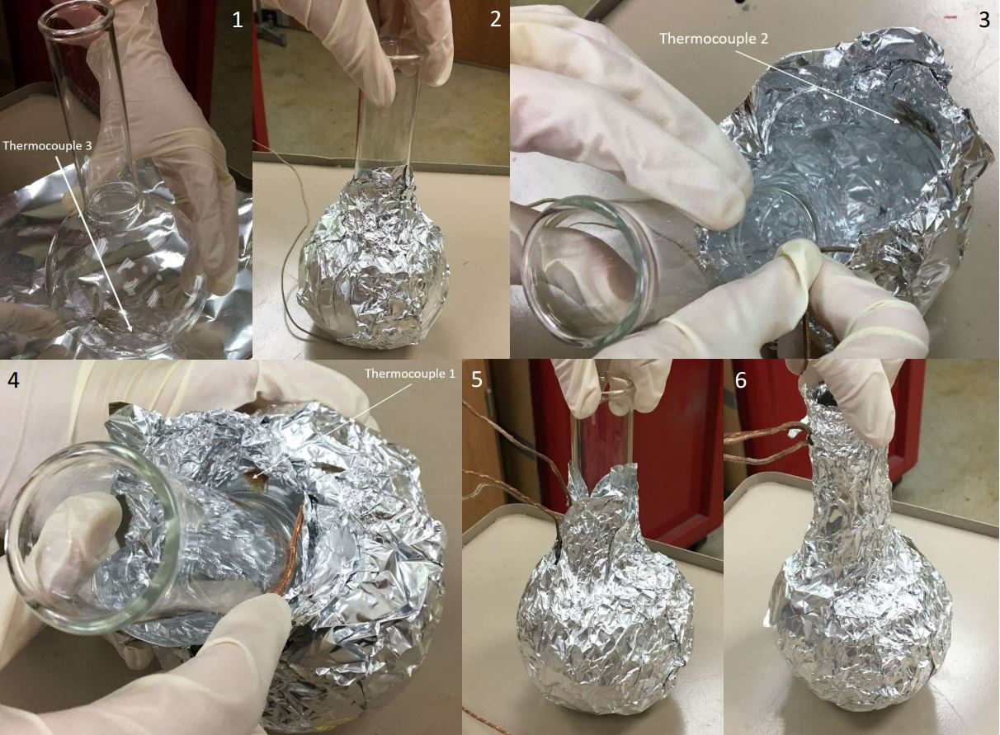
Steps for wrapping the flask in foil
<!--fig:wrap

1. Ensure the bracket screw is loose
1. Fit the neck of the flask in the center hole of the ceramic lid 
assembly with the lip of the flask fitting into the groove at the 
base of the center hole on both sides
1. Guide the thermocouple wires in the gap between the two ceramic 
halves so they are out of the way when the flask/lid assembly is 
inserted into the furnace
1. Slide the loose half of the ceramic back in to be snug 
around the flask neck, replace the spring, and tighten the nut on the top to hold it
in position

1. The two halves nearest to the top of the assembly should 
    meet or very nearly meet; if they don't then some 
    foil should be removed from the neck of the flask

1. Use a circular spring to help hold the halves together
  
1. Make a ``donut" of foil wrapped around the neck of the flask that 
will rest up against the bottom of the lid assembly
1. Slide the foil ``donut" up so and press it so it is flush against 
the ceramic and restricts air flow around the opening
1. Carefully turn the flask/lid assembly over making sure the flask 
doesn't fall out

1. textbfDo this over a table or close to a level surface 
    to avoid accidental breaking of the flask
1. The flask will fit into the lid assembly somewhat loosely, 
    but it shouldn't fall out
1. If the flask falls out, remove it and add more foil 
around the neck

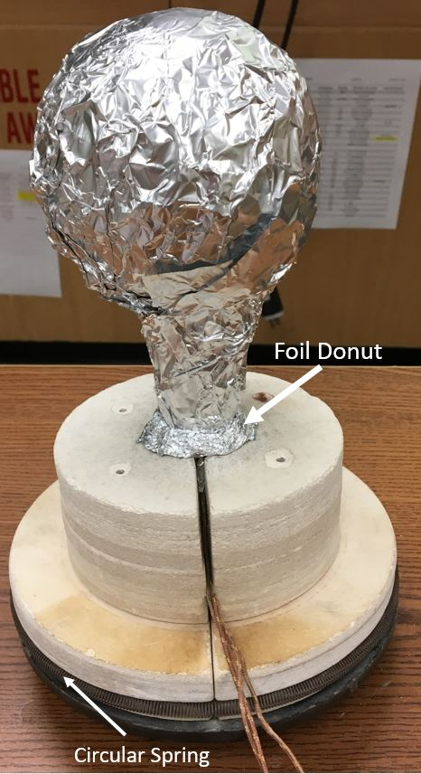
Final state of the flask/lid assembly
<!--fig:f_lid_done

1. See Figure reffig:f_lid_done for the final flask/lid
assembly before insertion into the furnace
1. Place the prepared flask/lid assembly into the furnace by gripping
the assembly with both hands by the screws on top and slowly 
lowering the assembly into place
1. Turn the flask/lid assembly so the thermocouple wires point away 
from the ARIA
1. Insert flask interior thermocouple (#4) carefully down the flask 
neck, making sure it goes straight in and the bead doesn't get 
caught anywhere

1. The bead of Thermocouple 4 should be suspended in the 
    approximate center of the flask, not be touching any part
1. The wire of Thermocouple 4 should run up the edge of the 
    neck and not the middle to allow compound to be injected 
    without making contact with the thermocouple
1. Use the bracket on one of the two screws on top of the 
    lid to secure the rubber hose holding the thermocouple
    in place
1. Tighten the nut on the bracket hand tight and then give a 
    half turn with a wrench to secure the nut (See Figure 
    reffig:wrench_tight)

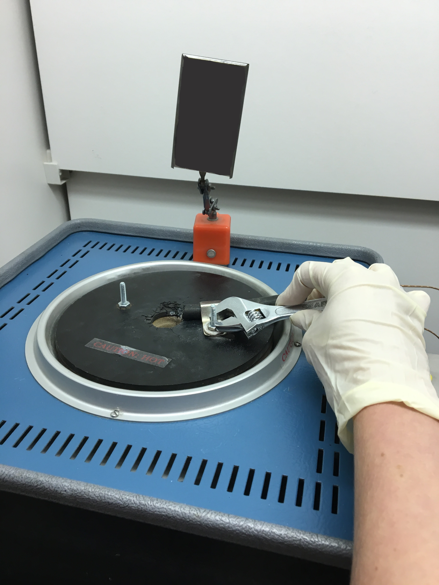
Position thermocouple 4 with the rubber hose and tighten
<!--fig:wrench_tight

1. Connect the thermocouple connectors to join the  
leads from the flask to the TADA, keeping the wires out of the way
of the ARIA and tucked down to the side of the furnace
1. Ensure the mirrors are set up correctly
1. The final setup should resemble Figure reffig:in_furnace

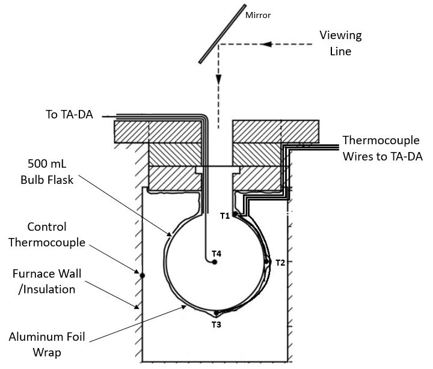
Diagram of the furnace when assembled
<!--fig:in_furnace

1. Flask Cleaning newline
For consistent experimental results, flasks must be as clean as possible
(See Figure reffig:clean_dirty). Dirty flasks can terminate radical 
reactions and artificially raise the AIT. To ensure flasks are as clean 
as possible before use, the following steps are required for flask 
cleaning:

1. Always begin by soaking the inside of the flask with soapy water 
for 12 1. 24 hours, regardless of how dirty it is
1. While soaking, the flask should always be secured to a ring stand
1. Wash out flask with soap and water, scrubbing the inside with 
tube brushes
1. For difficult stains, soak the flask inside with soapy water for 
another 24 hours or longer if needed 

1. During this process, scrub the inside and replace the 
soapy water on a regular basis (generally every 12 1. 24 hours)

1. Once all stains have been eradicated from the inside of the flask
and the flask has been scrubbed in soapy water, rinse the inside and
outside of the flask thoroughly

1. Using hot water for rinsing is preferred but not required
1. Rinse with tap water a minimum of 3 times, filling the flask
with water, agitating the water for about 10 seconds, and then 
dumping the water
1. Repeat this process with distilled water available from the 
smaller tap on the Northeast corner of the lab sink

1. If hard water spots or salt deposits appear on the inside of the 
flask, rinse the inside of the flask with a small amount of vinegar
to remove the deposits and repeat the rinse procedure above
1. Once the flask has been cleaned and rinsed thoroughly, place the 
clean flask on the drying rack over the sink
        

A clean flask (dirty flask in the background)
<!--fig:clean_dirty
      