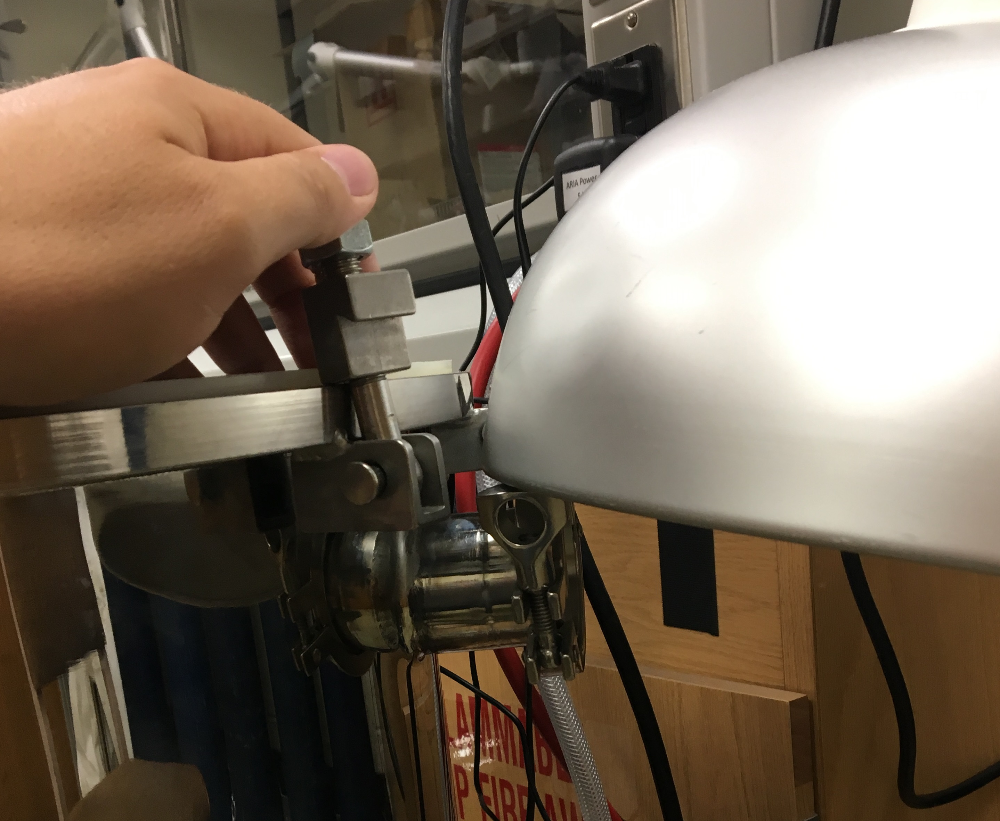

# Measurement and Data Collection {#sec:measurement-and-data-collection}

This section enumerates the procedure for measuring AIT. Researchers should follow these procedures every day and for every experiment performed to ensure consistent results. The first priority should always be safety. Therefore, if any step of this process is found to be unsafe or pose an unacceptable risk it should be changed. This method is designed to conform to the ASTM E659 Method. Therefore, any policies and procedures violate standards set forth in ASTM E659 should be rectified to maintain conformity.

## Startup {#sec:startup}

1. Ensure the lid is off the pressure vessel and the vessel is being 
    vented by the snorkel
    
    - Under normal operation, the vessel should be vented with the snorkel any time the vessel is open
    - The only exception to this rule is when the experimental setup has
    been shut down for an extended period of time for maintenance 
purposes
    
2. Check the lab book to see if the flask needs to be changed before turning on the furnace. If needed, change the flask (See Section @sec:flask-and-lid) and **indicate you did so in the lab notebook**.

2. Ensure the furnace is plugged in to the 220 V outlet on the edge of the hood

3. Power on the furnace and set furnace temperature between 10 - 20 degrees above your initial target flask temperature 

   - When powered on initially, the furnace may take 2 hours or more to reach a desired temperature and thermally equilibrate
   - Use the TADA User Interface to track the internal temperature of the flask
   - Once the internal temperature starts to reach equilibrium, you may adjust the set point temperature until the target temperature is reached
   - **CAUTION: The furnace may be hot during the start up sequence. Avoid touching anything inside the area enclosed by the aluminum ring atop the furnace including the ring itself.**

5. Ensure the vessel rupture disk is intact and positioned correctly (See Figure @fig:rupture_disk)

   - See the training on proper rupture disk installation (Section @sec:changing-the-rupture-disk) if the this is not the case

7. Ensure the 4 furnace thermocouples are connected to their 
   corresponding connectors inside the vessel and ensure that the wires are tucked down between the side of the furnace and the wall of the vessel and are out of the way (See Figure @fig:rupture_disk)
   
   - Thermocouple wires coming out of the furnace are numbered and should connect to the corresponding brown wire connected to  the TADA
     
   
   {#fig:rupture_disk}
   
7. Start up computer and log on

    - Use the "AIT Research Assistant" account to log in
      - Username: aitra
      - Password: hotflame16

8. Ensure a compatible SD card is inserted securely into the TADA datalogger (See Figure @fig:tada_connect)

9. Connect the TADA to the lab computer via the USB cable mounted 
    under the edge of the hood (see Figure @fig:tada_connect) 

10. Plug in the wall power to the TADA 24-volt power supply (see Figure @fig:tada_connect)

    {#fig:tada_connect}

11. Open the TADA user interface program

     - There should be a shortcut to this program on the desktop
     - Path: `/home/aitra/Documents/ait_exp/tada/tada_main.py`
     - The program will open two windows. **Ensure both windows are visible while using the program.** (The serial communication LED inside the TADA will start flashing.)

12. Twist both of the ARIA lead screws by hand such that the mounting plate is all the way down and touching the base plate and the push block all the way back and is touching the horizontal stepper motor. (This is the shutdown position. See Figure @fig:shutdown_position)

13. Ensure the three molex cables are securely plugged in to the ARIA (see Figure @fig:shutdown_position)
    
 - Regardless of the experiments to be performed, ensure all three are plugged in and the corresponding cables are not strained
   
14. Plug 5 volt power supply into the ARIA control and wait for initial setup sequence to complete (The two button lights on the ARIA control will come on when the sequence is complete) (See Figure @fig:shutdown_position)

     {#fig:shutdown_position}

15. Test the placement of the ARIA using the funnel and ring stand

     - Use nitrile gloves when touching the ARIA

     - Ensure the ring stand is secure in the ARIA, place the funnel in the ring stand and run the solid program (Press the  "Solid" Button **without gloves on**)

     - Note that the end of the ring stand rod must be nearly flush with the inside surface
        of the ring stand mount block (See Figure @fig:flush_r_stand)

     - If the funnel does not go directly into the flask, adjust the placement and retest 
       until properly positioned

        {#fig:flush_r_stand}

16. Test the placement of the mirror using the Camera Suite app and camera

     - Connect the computer to the camera's Wi-Fi (See Section @sec:connecting-to-the-camera on how to do this)
     - Open the Camera Suite app to use the camera's view finder
     - Mount the camera on the side of the furnace (See Section @sec:camera-placement-and-removal)
     - Using the camera's view finder, adjust the position of the mirror on the furnace to align the camera's view to see directly down the center of the flask
     - The camera should be positioned so that the hole in the furnace and the mirror are visible 
     - Once you have aligned the mirror, remove and shutdown the camera for initial furnace heating

17. Check the glass wool air filter in the inlet of the rotameter replace if necessary (See Section TO BE ADDED)

18. Once the target temperature is reached, allow the system to come to equilibrium

     - The "Temp Ready" indicator in the TADA User Interface window should turn green when the system has come to an acceptable equilibrated state
     - Sometimes the "Temp Ready" indicator may not turn green if the flask was not installed correctly (See Section @sec:flask-and-lid) or there are problems with the thermocouples even when the flask has reached thermal equilibrium. Therefore, while heating up or changing temperatures, check the temperatures that are displayed in the command line window of the TADA User Interface. If the temperatures are not within about 20 K of each other the thermocouples may not be placed properly. If this is the case experiments may proceed as normal but thermal equilibrium must be verified manually by using the data on the command line window and neglecting the misplaced thermocouple.
     - If any of the thermocouples in the command line window of the TADA User Interface read "NAN" (not a number) then that thermocouple is not connected. Check all thermocouple connections and reconnect the thermocouple if possible.

## Experimental {#sec:experimental}
This section outlines the steps for experimental runs. Each experiment should be performed following these steps exactly (insofar as that is possible). Doing so will ensure consistent results with the lowest uncertainty possible.

### Pre-Experimental Safety Checks {#sec:pre-experimental-safety-checks}

Before beginning experiments, ALL operators must do the following:

- Ensure your workspace, the area around the computer and both hoods are free of clutter, tripping hazards or anything which could present a hazard to you or anyone else in the lab
- Review Safety Data Sheets (SDS) and understand all hazards presented by all compounds that will be handled
  - This needs to be done only once before handling each compound for the first time but, SDS's should be reviewed periodically
  - All chemical handling should be done in the hood whenever possible. The main exceptions to this rule are for injection into the furnace and using the mass balance.
  - Refer to the compound's SDS for specific recommendations on chemical handling 
- Ensure you are using appropriate PPE for handling chemicals (e.g. nitrile gloves and splash goggles)
  - Refer to the SDS for the chemical you are working with when determining appropriate PPE
  - NOTE: Some SDS's will recommend using a face shield in addition to splash goggles when handing their respective  chemicals. In our lab we will use ventilation hoods which, when used properly, serve as better protection than face shields. Therefore, any time an SDS recommends using a face shield you may safely ignore that recommendation provided you are using the hood properly by positioning the sash between your face and the work being performed in the hood.
  - Unless an SDS states otherwise, lab coats are recommended but not required when handling chemicals

### Experimental Procedure Steps {#sec:experimental-procedure-steps}

1. Measure out sample

    - Liquids
      - Before measuring a sample out for the first time, clean the syringe of any residual compound
        1. Take 2 clean 100 ml beakers and put them in the hood (these will be your sample
           and waste beakers)
        2. Place a small amount of compound into the sample beaker
        3. Rinse the syringe of any extraneous compounds 3 times by drawing approximately 300 microliters into the syringe from the sample beaker and eject it into the waste beaker
      - Draw sample amount into a right-angle syringe
        1. Begin by drawing an excess amount of compound into the syringe
        2. Draw slowly to minimize air bubbles in the syringe
        3. Hold syringe vertically to move air bubbles to the top, gently tapping the 
           syringe if necessary
        4. Carefully eject the syringe into the waste beaker to remove any air bubbles until
           the syringe reads the desired amount
      - The final sample size should not exceed 250 microliters
    - Solids

      - Measure out sample on a weigh boat
        1. Open the scale door by pressing the button with an asterisk '*' and place a new and empty weigh boat on the center of the scale plate
        2. Close the scale door with the asterisk button, and tare the scale
        3. Remove the weigh boat before measuring out sample
        4. Using a clean chemical spatula, scoop the desired amount from the compound container to the weigh boat, replacing the weigh boat on the scale to check until the desired mass is reached
        5. Take note of the initial mass of the compound sample (the mass should exceed the desired mass by about 10 mg)
        6. With the sample and weigh boat on the scale, tare the scale
        7. Remove the weigh boat from the scale
      - The initial sample size should not exceed 300 mg
    - Gases

      - Draw sample amount into a right-angle syringe  
      - Sample size should not exceed 250 microliters
    
1. Secure the sample to the ARIA
    - Liquid/Gases Sample

      1. Place the syringe securely into the syringe holder on the ARIA, making sure the needle is in the funnel
      2. Test placement one more time to ensure the funnel is guided into the injection hole (use the **solid** button)
    - Solid Sample
      1. Carefully insert the weigh boat into the weigh boat holder sliding the securing wires out of the way as needed
      2. Gently tap the side of the weigh boat so that the sample collects in a pile near the leading corner of the weigh boat
      3. Press the weigh boat holder onto the servo shaft so the weigh boat is in a near-horizontal position
      4. Test placement one more time to ensure the funnel is guided into the injection hole (use the **liquid** button)
    
1. Remove gloves before proceeding

1. Ensure the camera battery sufficiently charged and the camera is powered on
   
    - Reconnect the camera to the tablet if necessary
    
1. Secure the camera to the side of the furnace
   
    - **Note for unpressurized experiments:** If you are performing unpressurized experiments (i.e. experiments with the lid off) you may safely skip the next **three** steps. Before proceeding, ensure that the vessel is being vented by the snorkel.
    
1. **Simultaneously** remove the snorkel from inside the vessel and place above the rupture disk (see Figure @fig:rupture_hood) **and** place lid on pressure vessel and secure in place with the clamps and cable

     {#fig:rupture_hood}

     - Two people are required to perform this step. One to remove the 
       snorkel (Person B) and the other to place the lid (Person A)   

     1. Person A: open the sash on the hood vertically and carefully pull out the vessel lid ensuring the outlet hose does not catch  on anything (do not pull it through the sliding doors)
        - Use caution when handling the lid; the lid is heavy
     1. Person B: Lift up the bell on the snorkel so it can swing away from the open pressure vessel
     1. Person A and B: Simultaneously, place the lid on the vessel and swing the snorkel away from the vessel. This should be done in one simultaneous motion.
     1. Person B: Place the snorkel over the rupture disk as seen in Figure fig:rupture_hood.
        - **The rest of the procedure requires only 1 person**
     1. When placing the lid, hold the lid directly above the vessel and carefully lower it straight down on the vessel to avoid hitting the ARIA with the lid. Make sure to avoid crimping the outlet hose and keep it as smooth and straight as possible
     1. Line up the two marks on the lid with the corresponding marks on the vessel
     1. Ensure the lid is centered on the vessel by running your fingers around the edge to ensure the edge of the vessel and the lid are flush 
     1. Check that the lid lies flat on the O-ring and no wires or debris will break the seal
     1. Hand tighten all the pressure vessel clamps on the lip of the lid so the slack is taken out
     1. Using your other hand to keep the pressure vessel from rotating, tighten the clamps in opposing pairs following the numbering on the back of each clamp (See Figure @fig:sec_lid) a 3/4" box wrench, tightening each clamp about 1/4 turn
     1. Tighten each clamp another 1/4 turn with the torque wrench, this time by going around the circle
     1. Loop the safety cable through both lid handles and through the handles on both sides of the vessel and then back through the lid handles so the two ends meet then secure the two ends together (See Figure @fig:sec_lid)

     {#fig:sec_lid}

1. Pressurize the vessel

     - **Safety glasses are required for everyone in the lab anytime the vessel is pressurized**
     - The absolute pressure in the vessel can be read at the bottom of the TADA User Interface window and should be plotted on the graph
       1. Ensure the ball valve connecting the regulators to the inlet hose is closed (valve handle perpendicular to the flow)
       2. Fully open the rotameter on the exhaust of the pressure vessel by **gently** rotating the rotameter knob counterclockwise 
       3. If it has not been done earlier in the day, slowly open the cylinder valve all the way and then turn back one quarter turn
       4. Once the regulators are pressurized, ensure the cylinder has enough pressure for the next run and the low pressure regulators are not over-pressurized (adjust the regulators as needed)
       5. Slowly open the ball valve to allow air to flow into the sealed pressure vessel
       6. Slowly close the rotameter (rotate the knob clockwise) until the air flow reads 25 SCFH (The flow rate is read at the middle of the floating ball)
       7. Allow 1-2 minutes for equilibrium to be reached initially
       8. Adjust pressure in vessel using low pressure regulator until the absolute pressure reading in the TADA User Interface is highlighted green  indicating that the pressure in the vessel is sufficiently close to 1 atm (760 torr +/- 2 torr)
          - This is easier with two people. One to read the pressure off the TADA User Interface and the other adjust the regulator
          - While pressurizing, make sure that the rotameter reads about 25 SCFH. This may take some adjusting back and forth.
          - Allow at least 20 secs for equilibration each time the pressure is changed
       9. Ensure that there are no leaks around the lid before proceeding
          - **Leak protocol:** If a loud, high pitched noise is heard or the pressure read on the TADA User Interface fails to rise, there is likely a leak. If this occurs, do the following:
            1. Identify where the leak is happening (using the sound or Snoop A.K.A. Soapy water)
            2. If the leak is happening anywhere besides the O-ring, immediately close the ball valve and allow the vessel to fully vent to ambient pressure to fix the leak
            3. If the leak is happening somewhere along the O- ring, verify that there is no debris or wires breaking the seal. If a seal break from debris or wires is found, immediately close the ball valve and allow the vessel to fully vent to ambient pressure to fix the leak
            4. If there is no debris or wires breaking the seal, use the wrench to slowly tighten the clamp nuts around the leak until it stops
            5. If none of these steps work or you suspect a different problem, immediately close the ball valve and allow the vessel to fully vent to ambient pressure to fix the leak

1. Look through the sight glass on the pressure vessel and ensure the vessel is sufficiently dark to see any flame from the mirror on top of the furnace

1. In the TADA User Interface program, press the "Choose Target File" button and choose where to save your file

     - Save all temperature data files in comma separated values (.csv) format

     - Example Path: `/home/aitra/Documents/data/compound_name/filename.csv`
     - File naming convention: 

       - Filenames will be organized by the following values in order separated by underscores ('`_`')
         1. Compound name
         2. Date of experiment with the format "YYMMDD"
         3. Time of day that data collection began for that run using a 24 hour clock format "hhmm"
         4. Sample size in microliters (for liquids) or milligrams(for solids and gases)
         5. Test temperature in degrees Celsius (rounded to the nearest integer)
       - For example: The file name of an AIT experiment where 100 microliters of hexane were tested at 450 degrees Celsius on March 19, 2013 at 4:25 pm would be:`hexane_130319_1625_100_450.csv`
     - This action will reset the TADA for measurement

1. Write down everything you know in the TADA window and the lab book (i.e. date, time, sample size, temperatures etc.).

1. Begin data collection 

      - **Note for unpressurized experiments:** If you are performing unpressurized experiments (i.e. experiments with the lid off) turn off the lights and ensure the laboratory is sufficiently dark to see any flame from the mirror on top of the furnace **before** beginning data collection.
      - In the TADA User Interface program, press the Enter key or click the "Collect Data" button on the TADA User Interface
      - The TADA User Interface will keep track of the elapsed time since data collection began at the bottom of the window. This may be used to time the experiment
      - Press the "Record" button on the Camera Suite app to start recording

1. Press the green or blue button on the ARIA control box that corresponds to the physical state of the sample (green for solid, blue for liquid) to initiate ARIA sample injection.

      - **NOTICE:** If you need to abort the injection before it completes, immediately unplug the AIRA power.
      - If you mistakenly press the wrong button, **do NOT abort the injection**. A button mis-press is inconsequential. Simply allow the injection to complete then press the correct button.

1. Watch for an ignition event for 10 minutes

      - Upon injection, a small temperature drop is always observed. This is the start of the 10 minutes
      - A temperature rise above the initial temperature indicates an exothermic reaction has occurred
      - An ignition event is defined by the presence of a visible flame (visible to either the camera or the operator)
      - An ignition event is characterized by a large, sharp temperature rise exceeding $15 \frac{K}{s}$. This is referred to as a temperature spike
      - The experiment ends when one of the following criteria is met:
        - An ignition event is observed and the temperature returns to a steady state
        - 10 minutes pass from the time of injection with no ignition event observed
      - Stop and power off the camera with the Capture app about 10 seconds after a temperature spike occurs or after a visible flame disappears
      - If temperature spike is observed, allow enough time for the temperature to return to a steady state before terminating temperature data collection
      - If no ignition event is observed nor expected after a temperature rise reaches a maximum, the camera may be stopped before 10 minutes have elapsed
      - The TADA may be used to keep track of time. A timer is also provided for that purpose.

1. If necessary, review the camera footage, looking for a flame corresponding to the temperature spike

      - This may be done by downloading the footage over the camera WiFi using the Camera Suite app

1. Record pertinent data and observations in the lab book and the TADA **BEFORE** terminating temperature data collection

      - The date of the experiment must be recorded once in the notebook
      - The following data must be present on the same row in the lab notebook, in the following order:
        1. Time of day that data collection began
        2. Compound name 
        3. Sample size in microliters (for liquids) or milligrams (for solids and gases). Solids will have an exact initial and final mass included instead of nominal mass.
        4. Set-point temperature of the furnace
        5. Test temperature in degrees Celsius (NOT rounded)
           - This should be the internal flask temperature (Thermocouple 4) prior to injection
        6. Indicate the type event that took place ("h" or "hot" for hot-flame ignition, "c" or "cold" for cool-flame ignition and "n" or "none" for no ignition)
           - If the flame is bright yellow/orange, this is considered a hot-flame autoignition
           - If the flame is faint or blueish, and does not show any yellow, orange, or red color, this is considered a cool-flame autoignition
      - If any item is not applicable write down N/A in its place
      - If any item is unknown, leave it blank until it can be determined
      - Optionally, leave any pertinent comments about the experiment next to or directly under this row of data (There is a 'notes' section in the TADA UI window for this purpose)
      - Record the same data in the corresponding fields in the TADA UI **before** terminating temperature data collection
      - The lot number and/or sample number of the compound container with the supplier and any other pertinent information related to the source of the compound should be recorded at least once in the lab notebook when first being used. Ensure that these data are present.
      - Likewise ensure the lot number of the air cylinder being used is also recorded when it was first brought into use.

1. After the experiment ends, terminate data collection

      1. Press the Enter key  again to stop data collection (the red light on the TADA should stop blinking)
      1. If you haven't already, press "Recording" button on the Camera Suite app to stop recording
      1. Shut down the camera from the Camera Suite app

1. Set furnace to next temperature

      - **Note for unpressurized experiments:** If you are performing unpressurized experiments (i.e. experiments with the lid off) you may safely skip the next **four** steps. Ensure before proceeding that the vessel is being vented by the snorkel.

1. Wait about 20 minutes after ignition to allow for the pressure vessel to be purged of the combustion products. If there was no ignition, only wait 10 minutes for the pressure vessel to purge after the experiment ends 

1. After the purge time has ended, depressurize the vessel
      1. Turn off the inlet air flow using the ball valve
      1. Fully open the rotameter by gently turning the knob counterclockwise
      1. Wait until the pressure vessel is **fully** depressurized (i.e. the rotameter reads zero)

1. Remove the pressure vessel lid by **first** loosening and disengaging the clamps and **secondly** removing the safety cable

   1. Loosen the clamps using a 3/4" wrench
   1.  Break the seal on the lid by briefly lifting the lid with the safety cable still in place
   1. Remove the safety cable from the vessel

1. **Simultaneously** lift off the lid and place snorkel inside the pressure vessel between 6" and 10" over the furnace (this may be done with 1 person)

   1. Lift the hood sash to allow the lid to be placed back inside
   1. Pull the bell of the snorkel up to allow the snorkel to swing up once the lid is removed
   1. Swing the snorkel to a position above the vessel
   1. Pull the bell back down to the end of the snorkel and let it fall on top of the lid so the snorkel will fall into place once the lid is removed
   1. Ensure the snorkel is loose enough to fall down into the vessel upon removing the lid
   1. Remove the lid by pulling directly upward before moving laterally and allow the snorkel to fall down into the venting position inside the vessel
   1. Place the lid carefully back in the hood and close the sash, running the lid outlet hose through the small opening in the corner of the sash
   1. Ensure the snorkel is placed properly and is venting the vessel

1. Remove the camera from the vessel

   - Connect it to the computer to begin video extraction if you haven't done that already
   - Connect the camera to power to charge if necessary

1. Remove any syringe or weigh boats used in the previous experiment

      - **Use gloves when doing this**
      - For experiments with solid compounds:
        1. Carefully remove the funnel and the weigh boat avoiding losing any residue from both of them
        2. Using a **clean** chemical spatula, carefully scrape any compound residue from the funnel into the weigh boat, cleaning the funnel of as much residue as possible
        3. Place the weigh boat on the scale you tared earlier
           - The mass displayed should be negative, this is the approximate mass that actually entered the flask multiplied by $-1$
        4. Note this weight as the final sample size in the lab notebook
        5. Rinse out the funnel of any remaining residue with acetone
        6. Dispose of any weigh boats in the solid waste

1. Clean out the flask between measurements by blowing hot air into the flask for 5 minutes using the heat gun on the low setting

   - The heat gun should **only** be plugged in to the outlet when in use
   - Do not point the heat gun towards the ARIA at any time

1. Extract, save and appropriately rename the video data between experiments (See Section @sec:video-extraction). Remember to delete the video
      off the camera once you have made sure that it is saved to the computer.

1. Once the next temperature is reached, allow the system to come to equilibrium

      - The "Temp Ready" indicator in the TADA User Interface window should turn green when the system has come to an acceptable equilibrated state

1. Once the system is at equilibrium, start this procedure over from step 1 (Measure Out Sample)

## Shutdown {#sec:shutdown}

 

The following should be done before leaving the lab at the end of every work day or any time the setup is not in use:

1. Power off the furnace
2. Shutdown TADA
   1. Close the TADA User Interface program
   2. Unplug TADA's USB connection
   3. Unplug the wall power from the TADA power supply
3. Shutdown ARIA and store accessories
   1. Unplug the ARIA power supply cable
   2. Remove and store any ARIA accessories used that day (leave the ring stand in place)
   3. Clean the funnel with appropriate solvents and dispose of the waste
   4. Appropriately, discard the contents of beakers and prepare them for dish washing
   5. Discard any residual sample in syringes and store them in the syringe box in the AIT drawer without rinsing <!--Change POLICY for syringes-->
   6. Store all chemicals in the appropriate cabinets
4. Remove any organic solid residue from working surfaces (See Section @sec:spill-clean-up) 
5. Ensure all air systems are depressurized 
   1. Ensure the ball valve is closed (the handle should be perpendicular to the flow)
   2. Slowly close the cylinder valve all the way
   3. Open the ball valve by turning the handle parallel to the flow
   4. Wait until both regulators depressurize
   5. **Leave the ball valve open**
6. Extract all data to the computer and appropriately rename them (Refer to Section refsec:data)
7. Determine if the flask should be changed, if so write this down in the lab notebook
8. Turn the camera Wi-Fi off then shut down and unplug the camera
9. Close all programs and shut down the computer

- A hot furnace may be left with the pressure vessel open and the snorkel venting it without waiting for it to cool
- Under normal use, disposable gloves may be thrown into the normal trash receptacle instead of solid chemical waste   

