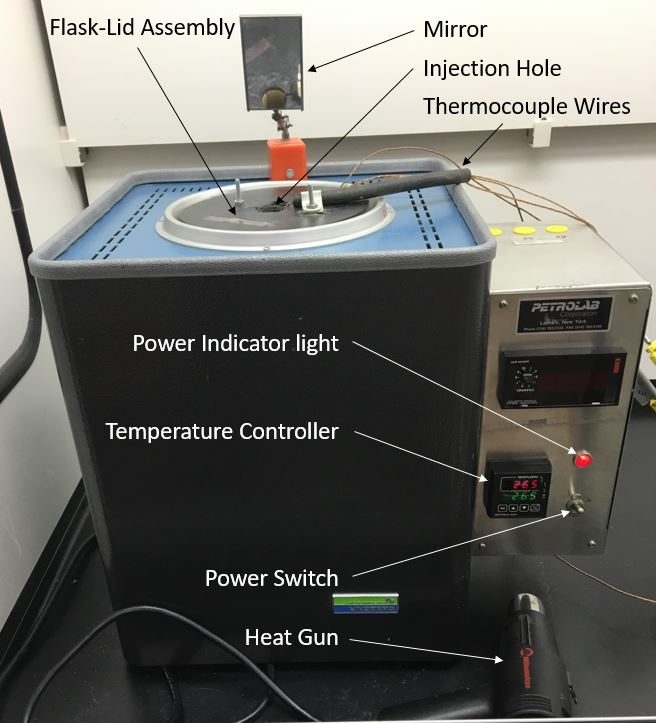

# Experimental Setup and Maintenance {#sec:experimental-setup-and-maintenance}

## Furnace {#sec:furnace}

### Overview {#sec:overview}

The furnace, shown in Figure @fig:furnace, is an encased stack of ceramic insulation with cavities cut out to allow space for the heating elements and the test flask (See the Figure @fig:in_furnace for an internal diagram of the furnace). The furnace is controlled with measurements taken at the insulated furnace wall. This design causes the furnace to have large temperature gradients while in operation. As a result, the set point temperature and the flask temperature will almost always differ significantly (as much as 25 K in some cases). Therefore, set points must be chosen between approximately 10 - 20 K above the desired temperature to reach that temperature inside the flask. **The reported AIT must be taken from the internal flask temperature (Thermocouple 4) and NOT the control thermocouple inside the furnace.** When powered on initially, the furnace may take up to 2 hours or more to reach a desired temperature and thermally equilibrate. Any time a desired temperature is reached, allow enough time for thorough thermal equilibration in the flask; allow extra time during initial start up.

{#fig:furnace}

### Furnace Operation {#sec:furnace-operation}

See Figure @fig:furnace for reference on how to operate the furnace

  1. Power on the furnace with the power switch and use the temperature controller to choose a set point temperature
     
1. To change the set point, press the up or down arrows until the desired temperature is reached
   - The lower (green) display is the set point and the upper (red) display is the control thermocouple temperature
1. When shutting down, turn off the power switch

## Camera {#sec:camera}

### Overview {#sec:overview}

Prior to using the experimental setup, all researchers must become familiar with basic use and operation of the GoPro&copy; HERO4 Session&trade; camera and Camera Suite&copy; software. 

GoPro Login:

- **username/email:** dipprlab.ait@gmail.com
- **password:** hotflame16

{#fig:cam_diag} <!--fig:cam_diag -->

### Connecting to the camera  {#sec:connecting-to-the-camera}

1. Firmly press and release the "info/wireless" button on the back of  the camera (not the red circle) multiple times until you see `APP` or `APP & RC` on the camera status screen
1. Press the "shutter/select" button (the button with the red circle) to confirm your selection
1. The "wireless status" (blue) light will begin flashing. This indicates the camera is broadcasting a Wi-Fi signal 
1. When first powering on the camera, ensure it is sufficiently charged. If not, immediately plug it in to charge it.
1. In the lower-right-hand corner of the desktop you will see an icon for internet connections. The computer should automatically connect to the Wi-Fi but if it does not, connect to the Wi-Fi using the following credentials:
   - Network Name: `ait_cam_2020`
   - Password: `hotflame16`
1. Open the Camera Suite&copy; app (There should be a shortcut on the desktop.)
1. If the app does not immediately try to connect to the camera, go to the pop up dialogue box and select `Hero 4` from the drop-down menu and click on `connect to camera`. 
   - The app should attempt to connect to the camera.
1. Press the "info/wireless" button to make the camera accept the connection from the computer.
1. On the right side of the Camera Suite&copy; app, the camera info along with control buttons should appear. This means the camera is connected.

### Camera Operation {#sec:camera-operation}

All operations may be done remotely via Wi-Fi or directly with the "info/wireless" and "shutter/select" buttons on the camera. For experimental purposes, only basic operations will be covered. For more detail on camera operation please see the GoPro&copy; HERO4 Session&trade; camera operation manual in the `docs` section of the `ait_exp` repository.

1. The "shutter/select" button toggles recording or standby; the camera will automatically shut off after a few seconds on standby
1. If the camera is remotely controlled, the on screen red button toggles recording or standby
1. During recording, the camera will not allow viewing via preview mode. This is due to the high frame rate of our experiments
1. Captured video may be reviewed, downloaded and managed remotely with camera browser button on the top left corner of the screen (make sure you hit "refresh" to update the contents in the camera).
1. The camera may be powered on and off remotely with the power button on the top right corner of the screen. The camera should be powered off between experiments or when not in use

### Shutdown {#sec:shutdown}

1. Press the "info/wireless" button until the camera status screen reads "Turn Wi-Fi Off"
2. Press the "shutter/select" button to confirm your selection
   - The "wireless status" (blue) light will stop flashing
3. Press the "info/wireless" button until the camera status screen reads "Exit"
4. Press the "shutter/select" button to confirm your selection

5. The camera will shutdown 

### Camera Placement and Removal {#sec:camera-placement-and-removal}

To mount the camera on the furnace:

1. Lift the tab on the corner of the camera cage 
2. Insert the camera from the front of the cage with the  "shutter/select" button facing up.
3. Snap the tab back to lock the camera into place. 

To remove the camera from the furnace:

1. Lift the tab on the corner of the camera cage 
1. Slide the camera out of the cage.

### Batteries {#sec:batteries}

1. USB chargers and cables are available for the camera
1. Charge batteries as needed. A charge above 80% is required before running an experiment to ensure the battery doesn't die during an experiment.
1. Do not overcharge the camera battery. Do not leave any battery charging overnight.

## Pressure Vessel {#sec:pressure-vessel}

### Changing the rupture disk {#sec:changing-the-rupture-disk}

We use 1100 alloy extra thin aluminum foil as a rupture disk. This material has been shown to be effective in preventing catastrophic failure in the vessel. This section outlines how to change and test the rupture disk. (See Figures @fig:rupture_disk and @fig:c_rupture_disk for reference)

{#fig:c_rupture_disk}

1. Remove the O-ring and the TC outlet ring from the pressure vessel by removing the TC clamp (See Figure @fig:rupture_disk)
1. place the O-ring on a piece of extra thin 1100 alloy aluminum foil

   - **Do NOT use the aluminum foil used for wrapping the flask, it is far too strong and may lead to a catastrophic failure of the vessel**
1. Rip the foil around the O-ring so it roughly matches the area of the O-ring
1. Sandwich the ripped foil in between the O-ring and the outlet ring
1. Place the combined rings and foil on the rupture outlet on the pressure vessel and fold any excess foil over the rupture outlet on the pressure vessel 
1. Secure the assembly on the pressure vessel using the TC clamp
1. The foil should appear smooth across the rupture surface without any folds or crumpled spots
1. The studded surface may still be apparent; this is normal

## Rotameter {#sec:rotameter}

### Disassembling the Rotameter {#sec:disassembling-the-rotameter}

1. gently squeeze plastic cover and pull off
1. using a small Allen wrench (~ 0.060") loosen the set screw on the rotameter dial and remove it
1. remove ring around the valve
1. use a 7/16" wrench to remove the valve assembly at the bottom of the rotameter
1. use 2 3/8" wrench and a 7/16" wrench to remove the inner part of the valve assembly
1. Unscrew the needle valve by hand so the valve assembly is completely disassembled (there should be 3 parts)
1. (DO NOT REMOVE THE O-RINGS)
1. use a 5/8" wrench to remove the brass hose fitting at the inlet to the rotameter
1. use a small screwdriver to pry off the plastic cap at the top of the rotameter
1. use a 1/8" Allen wrench to loosen the top screw over the rotameter sight glass to allow the sight glass to be removed
1. carefully remove the sight glass by tipping the top away from the rotameter and pulling up out of the bottom portion

## Flask and Lid {#sec:flask-and-lid}

### Notes about Flask and Lid {#sec:notes-about-flask-and-lid}

- **Latex or nitrile gloves and safety glasses are required while working with the flask/lid assembly**
- **Always store bulb flasks on the drying rack above the sink or appropriately secured to a ring stand (See Section @sec:flask-cleaning)**
- Using the TADA_UI, check the temperature of the furnace to ensure safe handling before changing the flask
  - The temperature should be close to ambient lab temperature
  - Do not perform maintenance or change the flask unless the internal temperature of the furnace is below $40^circ C$
- The flask in the furnace must be exchanged for a clean flask in the following situations:
  - The next experiment will be for a different compound
  - The next experiment will be for a new container of the same compound
  - There is reason to suspect that the flask has become contaminated or substantially dirty
  - The flask has been used for 10 runs without being cleaned
  - Once the AIT has been found for a compound, the final "confirmation" measurements should be repeated with a clean flask

### Disassembling the Flask and Lid{#sec:disassembling-the-flask-and-lid}

**NOTE: The furnace may be too hot to open for several hours after an experiment**

1. Unplug the thermocouples from the furnace
1. Once the furnace is cool, remove flask/lid assembly

   1. Loosen (do NOT remove) the nut that secures the bracket and the rubber hose to the top of the furnace with a wrench
   1. Move the bracket out of the way and remove Thermocouple 4 (along with the rubber hose) from the top of the furnace 
   1. Move the mirror out of the way to allow the flask/lid assembly to come out. Likewise ensure that the ARIA is out of the way
   1. Grip the assembly with both hands by the screws on top and pull directly upward
   1. **NOTE: The flask/lid assembly is heavy and pulling it out can be awkward. Please ask someone to help you remove it if you are at all unsure about removing the assembly**
1. The flask/lid assembly should easily come out of the furnace without catching on anything
1. **Carefully set the assembly on a table or other stable surface with the flask on top (See Figure reffig:f_lid_done)**
1. Ensure the bracket screw is loose
1. Remove the circular spring from its groove and slide the ceramic halves of the lid apart sufficiently to allow the flask to be removed
1. Remove flask from lid assembly and  remove all of the aluminum foil and thermocouples from the flask
1. Discard the used aluminum foil in a normal trash can and set aside the thermocouples in the hood or on a surface where they will not catch on anything or become damaged
1. Check the thermocouples and thermocouple wiring for damage or fraying that may affect thermocouple performance. If needed, replace the thermocouples before assembling the flask and lid.

### Assembling the Flask and Lid

- Use the figures in this section as a reference when putting together the assembly

- Use a **clean**, 500 ml, round bottom, long neck, bulb flask (PYREX&copy;  500mL Long Neck Boiling Flask, Round Bottom, Tooled Mouth, Product No.: 4280-500 from Corning Inc.)

1. If dirty, wash out the flask using soap and water and dry as much as possible (See Section @sec:flask-cleaning); be sure to rinse thoroughly

1. Any leftover water will boil away when the furnace heats up and before any measurements are taken

1. Wrap entire flask in aluminum foil with thermocouples at the bottom, side and top of the round part of the flask (thermocouples should be touching the glass directly) (Refer to Figure @fig:wrap) **NOTE: The more reflective side of the foil should always be facing inward**

   1. Start by getting a long strip of aluminum foil (12" long or so)
   1. Use a utility knife or pin to poke a small hole (just big enough to poke the bead through) near the middle of the foil and insert thermocouple 3 through the foil so the bead sits at the bottom of the flask and then wrap the foil around the bottom (1 and 2)
   1. Slide thermocouple 2 down to the approximate middle/equator of the flask between the flask and foil and run a couple of inches around the equator so that it stays in place  
   1. Use a second piece of foil to wrap further up the flask, ensuring the thermocouple wires run parallel up the side of the flask (3)
   1. Place thermocouple 1 at the top of the bulb of the flask (**NOT** on the neck of the flask) and use a third piece of foil to wrap around the top starting at the middle (4)
   1. Add an additional layer of foil around  the flask so the wires are covered and run parallel when wrapping is finished (5)
   1. Wrap additional foil around the neck of the flask to cover it completely and secure flask in lid assembly
   1. The thermocouple wires should emerge from the foil covering near the top (but not at the top) of the flask neck, allowing them to run between the two ceramic halves of the lid assembly (6)

     {#fig:wrap}

1. Ensure the bracket screw is loose

1. Fit the neck of the flask in the center hole of the ceramic lid assembly with the lip of the flask fitting into the groove at the base of the center hole on both sides

1. Guide the thermocouple wires in the gap between the two ceramic halves so they are out of the way when the flask/lid assembly is inserted into the furnace

1. Slide the loose half of the ceramic back in to be snug around the flask neck, replace the spring, and tighten the nut on the top to hold it in position

   - The two halves nearest to the top of the assembly should meet or very nearly meet; if they don't then some foil should be removed from the neck of the flask

1. Use a circular spring to help hold the halves together

1. Make a "donut" of foil wrapped around the neck of the flask that will rest up against the bottom of the lid assembly

1. Slide the foil "donut" up so and press it so it is flush against the ceramic and restricts air flow around the opening

1. Carefully turn the flask/lid assembly over making sure the flask doesn't fall out

    - **Do this over a table or close to a level surface to avoid accidental breaking of the flask**
    
    - The flask will fit into the lid assembly somewhat loosely, but it shouldn't fall out
    
    - If the flask falls out, remove it and add more foil around the neck
    
1. See Figure @fig:flid_done for the final flask/lid assembly before insertion into the furnace

1. Place the prepared flask/lid assembly into the furnace by gripping the assembly with both hands by the screws on top and slowly lowering the assembly into place

1. Turn the flask/lid assembly so the thermocouple wires point away from the ARIA

1. Insert flask interior thermocouple (#4) carefully down the flask neck, making sure it goes straight in and the bead doesn't get 
   caught anywhere
   
1. The bead of Thermocouple 4 should be suspended in the approximate center of the flask, not be touching any part

1. The wire of Thermocouple 4 should run up the edge of the neck and not the middle to allow compound to be injected without making contact with the thermocouple

1. Use the bracket on one of the two screws on top of the lid to secure the rubber hose holding the thermocouple in place

1. Tighten the nut on the bracket hand tight and then give a half turn with a wrench to secure the nut (See Figure @fig:flid_done)

1. Connect the thermocouple connectors to join the  
     leads from the flask to the TADA, keeping the wires out of the way
     of the ARIA and tucked down to the side of the furnace

    {#fig:flid_done}

1. Ensure the mirrors are set up correctly

1. The final setup should resemble Figure @fig:in_furnace

{#fig:in_furnace}

### Flask Cleaning {#sec:flask-cleaning}
For consistent experimental results, flasks must be as clean as possible (See Figure @fig:clean_flask). Dirty flasks can terminate radical reactions and artificially raise the AIT. To ensure flasks are as clean as possible before use, the following steps are required for flask cleaning:

1. Always begin by soaking the inside of the flask with soapy water for 12 - 24 hours, regardless of how dirty it is
1. While soaking, the flask should always be secured to a ring stand
1. Wash out flask with soap and water, scrubbing the inside with tube brushes
1. For difficult stains, soak the flask inside with soapy water for another 24 hours or longer if needed 
1. During this process, scrub the inside and replace the soapy water on a regular basis (generally every 12 - 24 hours)
1. Once all stains have been eradicated from the inside of the flask and the flask has been scrubbed in soapy water, rinse the inside and outside of the flask thoroughly. *Using hot water for rinsing is preferred but not required*
   1. Rinse with tap water a minimum of 3 times, filling the flask with water, agitating the water for about 10 seconds, and then dumping the water
   1. Repeat this process with distilled water available from the smaller tap on the Northeast corner of the lab sink
   1. If hard water spots or salt deposits appear on the inside of the flask, rinse the inside of the flask with a small amount of vinegar to remove the deposits and repeat the rinse procedure above
1. Once the flask has been cleaned and rinsed thoroughly, place the clean flask on the drying rack over the sink

     {#fig:clean_flask}
